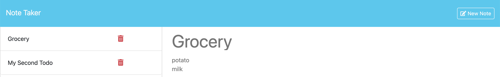

# Note Taker using Express-JS

[GitHub Repo link](https://github.com/salidamaharjan/note-taker-express-js)

[Deployed Heroku link](https://salida-note-taker-express-js-f6e2c95064ea.herokuapp.com/)

## Description
* This project is completed to build a note taker app which looks like below:

* Express JS is used in this project.
* The user can create a note.
* The note can be saved. 
* They can also delete the note if completed or not needed.

## Table of Content
1. [Installation](#installation)
2. [Run](#run)
3. [Usage](#usage)
4. [Deploy](#deploy)
5. [Credits](#credits)
6. [License](#license)
7. [Contact](#contact)

## Installation
* Node.js
* [Heroku CLI](https://devcenter.heroku.com/articles/heroku-cli#install-the-heroku-cli)

## Run
* Use `npm i` to install the dependencies
* Use `npm start` to run the project

## Usage
* User can create a note, save them and delete it when task completed.

## Deploy
* Make sure you have Heroku CLI installed. [Heroku CLI](https://devcenter.heroku.com/articles/heroku-cli#install-the-heroku-cli)
* Login to heroku CLI using `heroku login` command.
* Create a heroku app using `heroku create app-name` command.
* Deploy to heroku using `git push heroku` command.
* Note: When defining express port you need to use `process.env.PORT`

## Credits
* BootCamp course work, instructor and tutor session.
* [Node.js](https://nodejs.org/dist/latest-v10.x/docs/api/fs.html)
* [Express.js](https://expressjs.com/en/guide/using-middleware.html)
* [MDN Docs](https://developer.mozilla.org/en-US/docs/Web/JavaScript/Reference/Global_Objects/Array/filter)
* [Heroku Dev Center](https://devcenter.heroku.com/articles/deploying-nodejs)
* [FreeCodeCamp](https://www.freecodecamp.org/news/how-to-deploy-your-site-using-express-and-heroku/)

## License

A short, permissive software license. Basically, you can do whatever you want as long as you include the original copyright and license notice in any copy of the software/source. There are many variations of this license in use.

## Contact
Should you have any question, you can reach me at:

[GitHub](https://github.com/salidamaharjan)

[Email Me](mailto:email@email.com)